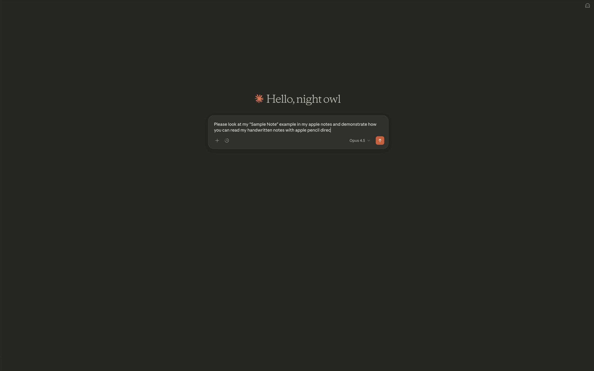

# Apple Notes OCR

Extract and OCR handwritten notes from Apple Notes on macOS. Includes a CLI tool and an MCP server for AI Agent integration.



## Features

- Read Apple Notes content (text, metadata)
- Extract drawings/sketches as PNG images for OCR
- Search notes by title
- MCP server for Claude Code integration
- Filter notes by folder or title pattern for privacy

## Important Disclaimers

### Direct Database Access

This tool directly reads the Apple Notes SQLite database. This means:

- **Read-only**: Cannot create or modify your notes
- **macOS only**: Requires access to Apple's Notes database location
- **May break**: Apple may change the database format in future macOS updates without warning
- **No encryption support**: Password-protected notes cannot be read
- **Local only**: Only reads notes stored on your Mac (iCloud-synced notes are stored locally)

### Security Notice

This tool requires **Full Disk Access** for your terminal application (Terminal.app, iTerm2, etc.).

> **Warning**: Granting Full Disk Access to your terminal means ALL scripts and commands run in that terminal session can access protected files. Only grant this permission if you understand the security implications.

This is required because Apple Notes stores its database in a TCC-protected location. There is no workaround due to how macOS handles permissions for terminal-launched processes.

## Requirements

- macOS (Apple Notes database access)
- Python 3.11+
- [uv](https://docs.astral.sh/uv/) package manager
- **Full Disk Access** for your terminal app

### Granting Full Disk Access

1. Open **System Settings**
2. Go to **Privacy & Security** > **Full Disk Access**
3. Click the **+** button
4. Add your terminal application:
   - Terminal.app (`/System/Applications/Utilities/Terminal.app`)
   - iTerm2 (`/Applications/iTerm.app`)
   - Ghostty (`/Applications/Ghostty.app`)
   - Or whichever terminal you use
5. Restart your terminal

> **Why the terminal?** When you run commands via `uvx`, macOS traces permissions back to the parent terminal application, not to the Python script or uv binary. There is no workaround for this.

## Installation

```bash
# Install via uvx (recommended)
uvx --from git+https://github.com/USER/apple-notes-ocr apple-notes-ocr --help

# Or clone and install locally
git clone https://github.com/USER/apple-notes-ocr
cd apple-notes-ocr
uv sync
```

## CLI Usage

```bash
# List all notes
uv run apple-notes-ocr

# List notes as JSON
uv run apple-notes-ocr --format json

# Search notes by title
uv run apple-notes-ocr --search "meeting"

# Get a specific note by ID
uv run apple-notes-ocr --note-id 123

# Export all notes to a directory
uv run apple-notes-ocr --export ./output

# Export with drawings
uv run apple-notes-ocr --export ./output --include-drawings

# List available drawings
uv run apple-notes-ocr --list-drawings
```

### Output Formats

- `text` (default) - Plain text output
- `json` - Structured JSON
- `markdown` - Markdown with image references

## MCP Server

The MCP server exposes Apple Notes to Claude Code with 5 tools:

| Tool | Description |
|------|-------------|
| `list_notes` | List all notes with metadata and `has_drawings` flag |
| `search_notes` | Search notes by title with content preview |
| `get_note` | Get note content with `[DRAWING:uuid]` markers. Set `include_drawings=true` to embed images for OCR |
| `list_attachments` | List all attachments for a note WITHOUT image data (avoids size limits) |
| `get_drawing` | Fetch a single drawing as PNG image by UUID |

### Setup for Claude Code

Add to `~/.claude/settings.json`:

```json
{
  "mcpServers": {
    "apple-notes": {
      "command": "uvx",
      "args": ["--from", "git+https://github.com/USER/apple-notes-ocr", "apple-notes-ocr-mcp"]
    }
  }
}
```

Or for local development:

```json
{
  "mcpServers": {
    "apple-notes": {
      "command": "uv",
      "args": ["run", "--directory", "/path/to/apple-notes-ocr", "apple-notes-ocr-mcp"]
    }
  }
}
```

### Filtering Notes

You can block certain notes from being accessed via environment variables:

```json
{
  "mcpServers": {
    "apple-notes": {
      "command": "uvx",
      "args": ["--from", "git+https://github.com/USER/apple-notes-ocr", "apple-notes-ocr-mcp"],
      "env": {
        "APPLE_NOTES_BLOCKED_FOLDERS": "Private,Work Confidential",
        "APPLE_NOTES_BLOCKED_TITLES": "Secret*,*password*"
      }
    }
  }
}
```

| Environment Variable | Description |
|---------------------|-------------|
| `APPLE_NOTES_BLOCKED_FOLDERS` | Comma-separated folder names to block |
| `APPLE_NOTES_ALLOWED_FOLDERS` | Comma-separated folder names to allow (whitelist mode) |
| `APPLE_NOTES_BLOCKED_TITLES` | Comma-separated title patterns to block (supports `*` wildcards) |

### Handling Notes with Many Drawings

When a note has many drawings (10+), using `get_note(include_drawings=true)` may exceed MCP's response size limit. Instead, use this pattern:

```
1. get_note(note_id=123)           # Get note content with [DRAWING:uuid] markers
2. list_attachments(note_id=123)   # See all attachments without fetching images
3. get_drawing(attachment_id=uuid) # Fetch drawings one at a time as needed
```

### OCR Workflow for Handwritten Notes

The MCP server can embed drawing images directly so Claude can OCR your handwritten notes:

```
User: "Read my HVTs note and transcribe the handwritten drawings"

Claude:
1. search_notes(query="My Note") → finds note pk=3762
2. get_note(note_id=3762, include_drawings=true) → returns:
   - Text content with [DRAWING:uuid] markers showing where drawings appear
   - All drawing PNGs embedded as images
3. Claude sees the images and can OCR/describe the handwritten content
```

The note content shows markers like:
```
INBOX

[DRAWING:7521214C-10D1-465D-AAD9-E5E9160D90E4]

My heading
...
```

So you know exactly where each drawing appears in context.

### Example Prompts

- "List my notes that have drawings" → `list_notes`
- "Show me the note about project ideas" → `search_notes` + `get_note`
- "Read my HVTs note and OCR all the drawings" → `get_note(include_drawings=true)`
- "Show me just the first drawing from that note" → `get_drawing(uuid)`

## How It Works

Apple Notes stores data in a SQLite database at:
```
~/Library/Group Containers/group.com.apple.notes/NoteStore.sqlite
```

Note content is stored as gzip-compressed Protocol Buffer data. Drawings are pre-rendered as PNG files in the `FallbackImages` directory.

This tool:
1. Queries the SQLite database for notes and metadata
2. Decompresses and parses the protobuf content
3. Maps drawing attachments to their FallbackImage PNGs

## Limitations

- **Read-only** - Cannot create or modify notes
- **Encrypted notes** - Password-protected notes are skipped
- **macOS only** - Requires access to Apple Notes database
- **Drawings only** - Other attachments (images, PDFs) not yet fully supported
- **May break with macOS updates** - Apple may change the database format

## License

MIT License - see [LICENSE](LICENSE) file.
